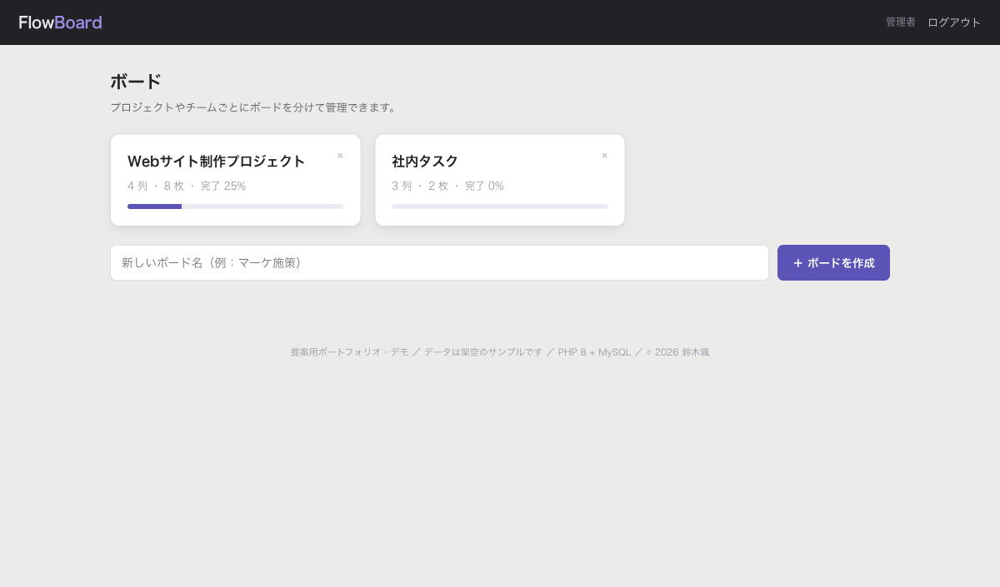
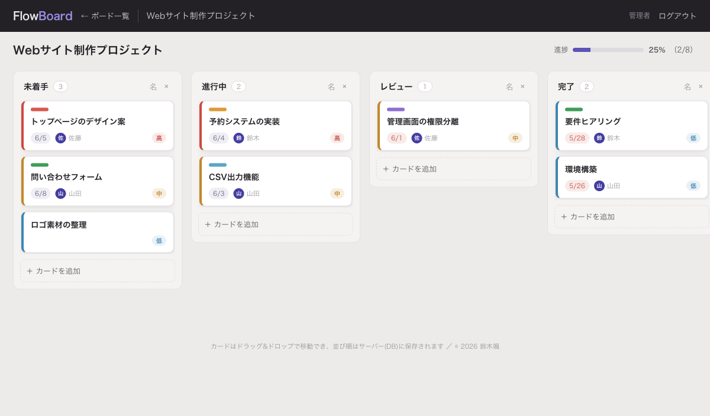

# タスク/案件管理 カンバン（PHP + MySQL）

チームのタスク・案件を見える化する **カンバンボード** です。ボード／列／カードを管理し、**ドラッグ&ドロップの並び替えをサーバー（DB）に保存**する、PHP 8 + MySQL によるサーバーサイドの実装です。

> 注意：PHP/MySQL で動くアプリのため、GitHub Pages では動きません。
> ライブデモは PHP が動くレンタルサーバー／共有ホスティングに設置してご覧ください（手順は下記）。

| ボード一覧（プロジェクト別） | ボード（ドラッグ&ドロップ） |
|---|---|
|  |  |

## 主な機能
- ログイン認証（管理者）
- **複数ボード**（プロジェクト／チーム別）の作成・削除
- 列（カラム）の追加・名称変更・削除
- カードの追加・編集・削除（タイトル・説明・担当者・期限・優先度・ラベル色）
- **ドラッグ&ドロップ**でカードを列間・列内に移動 → **並び順をDBに保存**（AJAX）
- 完了率の進捗バー・各列のカード件数・期限切れの色分け

## 技術ポイント（重視した点）
- **ドラッグ移動を AJAX（fetch）でサーバーに永続化**。移動先カラムの並びをトランザクションで再採番
- **CSRFトークン**を全フォーム＋AJAX（`X-CSRF-TOKEN` ヘッダ）で検証
- **認可チェック（IDOR対策）**：操作対象のカード・列が「そのボードに属するか」を毎回サーバー側で検証。他ボードのデータは操作不可
- **PDO プリペアドステートメント**で全SQL（SQLインジェクション対策）
- 正規化スキーマ：boards → board_columns → cards（外部キー・ON DELETE CASCADE）
- パスワードは `password_hash`（bcrypt）／セッション固定化対策／出力は全てエスケープ
- `includes/`・`sql/` は `.htaccess` で直接アクセス禁止

## 技術スタック
- PHP 8（フレームワーク不使用）／ MySQL 8（InnoDB・外部キー）／ ドラッグ&ドロップはネイティブ HTML5 DnD
- 依存ライブラリなし。共有ホスティングにそのまま設置可能。

## セットアップ
```bash
mysql -u root -p -e "CREATE DATABASE kanban CHARACTER SET utf8mb4 COLLATE utf8mb4_unicode_ci;"
mysql -u root -p kanban < sql/schema.sql
cp includes/config.sample.php includes/config.php   # → db.user / db.pass を編集
php -S localhost:8000
```
ログイン：`admin@example.com` ／ `kanban-admin-2026`

## ファイル構成
```
login.php / logout.php   認証
index.php                ボード一覧（作成・削除）
board.php                ボード表示・カード/列のCRUD・移動の永続化(AJAX)
includes/                bootstrap・DB(PDO)・認証・CSRF・ヘルパ
assets/style.css         スタイル
sql/schema.sql           スキーマ＋初期データ
```

## 補足
データはすべて架空のサンプルです。実装版では、複数ユーザー・権限、コメント、添付、リアルタイム同期などを追加できます。

---
© 2026 鈴木颯（個人事業 / システム開発）
